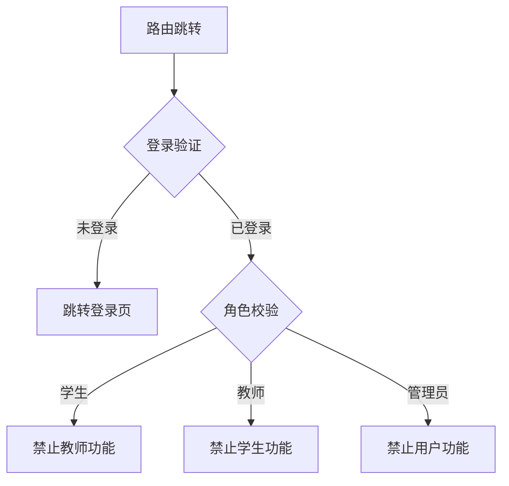

### 路由守卫安全机制说明

1. **全局路由守卫启用**
	- 通过 `router.beforeEach` 实现全路由拦截，防止用户通过直接输入 URL 违规访问未授权资源
	- 安全策略覆盖所有动态路由（含 `/:id` 路径参数的路由）和静态路由
	- 采用多层防御机制：
		- 身份认证检查
		- 角色权限校验
		- 资源归属验证

2. **动态路径参数的安全校验**
	- 对含路径参数（如 `/:id`）的关键路由进行深度权限验证：
	- 四层验证机制：
		1. **身份认证**：检查用户登录状态
		2. **角色授权**：基于用户角色过滤禁止访问的页面
		3. **资源归属**：通过 API 验证用户与资源的所属关系
		4. **操作权限**：验证用户对具体操作的执行权限

3. **角色权限精细控制**
	- **学生(Student)**：
		- 禁止访问教学管理功能（创建班级/课程/练习等）
		- 限制访问管理看板（教师/学生列表等）
	- **教师(Teacher)**：
		- 禁止访问学习功能（练习反馈/自测历史等）
		- 限制访问管理功能（系统概览/知识库设置等）
	- **管理员(Tutor)**：
		- 禁止访问教学/学习功能（班级/课程详情等）
		- 重定向至管理界面（教师列表）

4. **关键资源的 API 级安全验证**
   - **练习参与权限**：
        ```typescript
        if (to.name === 'TakeExercise') {
            // 验证练习是否属于学生所在班级
            const exerciseRes = await ExerciseApi.getExerciseDetails(practiceId)
            const classId = exerciseRes.data?.classId
            const classRes = await ClassApi.getUserClasses(authStore.user.id)
            const inClass = classRes.data.some(cls => String(cls.id) === classId)
        }
        ```
	- **批改权限验证**：
        ```typescript
        if (to.name === 'CheckExercise') {
            // 双重验证：
            // 1. 教师是否负责该班级
            const teacherClasses = await ClassApi.getTeacherClasses(authStore.user.id)
            const isTeacherOfClass = teacherClasses.some(cls => ...)
        
            // 2. 提交记录是否属于指定练习
            const submissions = await ExerciseApi.getPendingJudgeList(...)
            const validSubmission = submissions.some(sub => ...)
        }
        ```

5. 安全增强技术
    - **动态模块加载**：解决 Pinia 初始化时序问题
        ```typescript
        const ExerciseApi = (await import('@/api/exercise.ts')).default
        ```
    - **异常熔断机制**：所有 API 验证异常触发安全重定向
        ```typescript
        } catch (e) {
            next({ name: 'Home' }) // 统一异常处理
        }
        ```
    - **操作级权限控制**：
        ```typescript
        // 教师只能编辑自己班级的练习
        if (to.name === 'ExerciseEdit' && authStore.user.role === 'teacher') {
            // 验证班级教师关系
            const isTeacherOfClass = ...
        }
        ```

6. 安全审计要点

   - 所有包含 `/:id` 参数的路由均实施资源归属验证

   - 管理员操作重定向至管理控制台（非首页）

   - 学生/教师权限采用互斥设计（禁止跨角色访问）

   - 每次路由跳转执行实时权限校验（非缓存策略）

### 技术实现特点

1. **纵深防御体系**：
	- 前端路由守卫 + 后端 API 验证双重保障
	- 角色权限 + 资源归属 + 操作许可三重校验

2. **动态安全策略**：


3. **错误防御机制**：
	- 所有异步操作包含 try/catch 安全边界
	- 验证失败统一重定向至安全页面
	- 关键操作日志输出（开发环境）

此安全架构有效防止了 URL 直接访问漏洞，确保所有资源访问均通过严格权限验证，符合最小权限原则。