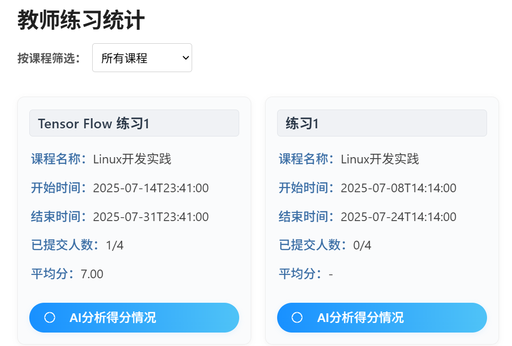
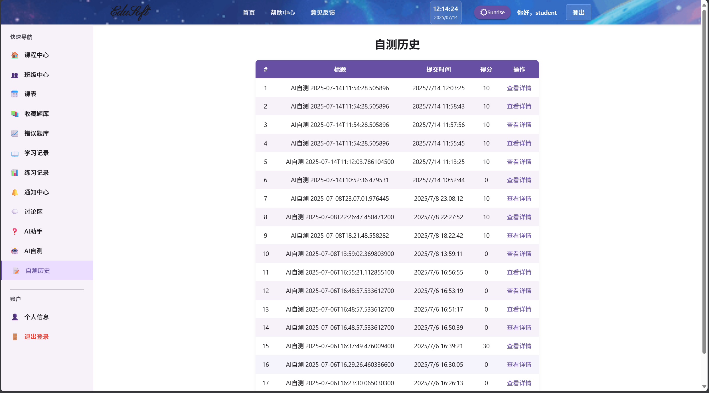
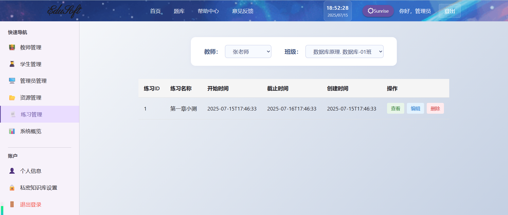
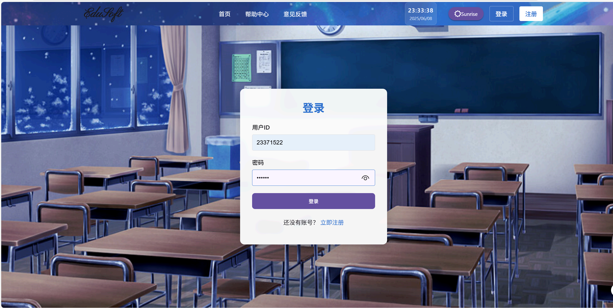

# AI智能教学实训智能体平台用户手册
<!-- TOC -->
- [AI智能教学实训智能体平台用户手册](#ai智能教学实训智能体平台用户手册)
  - [1. 概述](#1-概述)
    - [1.1 背景](#11-背景)
    - [1.2 编写目的](#12-编写目的)
    - [1.3 适用对象](#13-适用对象)
  - [2. 软件概述](#2-软件概述)
    - [2.1 项目目标](#21-项目目标)
    - [2.2 子系统介绍](#22-子系统介绍)
    - [2.3 功能模块介绍](#23-功能模块介绍)
      - [用户管理模块](#用户管理模块)
      - [课程管理模块](#课程管理模块)
      - [班级管理模块](#班级管理模块)
      - [教学资源模块](#教学资源模块)
      - [在线练习模块](#在线练习模块)
      - [学习记录模块](#学习记录模块)
      - [学习助手模块](#学习助手模块)
      - [题库与收藏模块](#题库与收藏模块)
      - [管理端功能](#管理端功能)
    - [2.4 性能介绍](#24-性能介绍)
  - [3. 系统各页面进入方式](#3-系统各页面进入方式)
    - [3.1 本地文件进入方式](#31-本地文件进入方式)
    - [3.2 域名进入方式](#32-域名进入方式)
  - [4. 赛题核心功能使用说明](#4-赛题核心功能使用说明)
    - [4.1 教师端核心功能](#41-教师端核心功能)
      - [4.1.1 资料上传与知识库更新](#411-资料上传与知识库更新)
      - [4.1.2 备课与教案设计](#412-备课与教案设计)
      - [4.1.3 考核内容自动生成](#413-考核内容自动生成)
      - [4.1.4 学情数据分析](#414-学情数据分析)
      - [4.1.5 私密知识库与联合知识库设计（核心创新）](#415-私密知识库与联合知识库设计核心创新)
    - [4.2 学生端核心功能](#42-学生端核心功能)
      - [4.2.1 ai智能问答](#421-ai智能问答)
      - [4.2.2 ai自测](#422-ai自测)
    - [4.3 管理端核心功能](#43-管理端核心功能)
      - [4.3.1 用户与资源管理](#431-用户与资源管理)
      - [4.3.2 系统大屏与数据可视化](#432-系统大屏与数据可视化)
  - [5. 其他功能使用说明](#5-其他功能使用说明)
    - [5.1 登录/注册页面](#51-登录注册页面)
      - [5.1.1 登录界面](#511-登录界面)
      - [5.1.2 注册界面](#512-注册界面)
    - [5.2 用户个人信息页面](#52-用户个人信息页面)
      - [5.2.1 修改个人信息页面](#521-修改个人信息页面)
      - [5.2.2 忘记密码界面](#522-忘记密码界面)
    - [5.3 讨论区](#53-讨论区)
    - [5.4 通知区](#54-通知区)
    - [5.5 课程模块](#55-课程模块)
      - [5.5.1 老师端](#551-老师端)
      - [5.5.2 学生端](#552-学生端)
    - [5.6 班级管理](#56-班级管理)
      - [5.6.1 老师端](#561-老师端)
      - [5.6.2 学生端](#562-学生端)
    - [5.7 题库中心-老师](#57-题库中心-老师)
      - [5.7.1 题库页面](#571-题库页面)
      - [5.7.2 新建题目页面](#572-新建题目页面)
      - [5.7.3 查看题目详情页面](#573-查看题目详情页面)
    - [5.8 收藏题库界面-学生](#58-收藏题库界面-学生)
      - [5.8.1 收藏题库列表界面](#581-收藏题库列表界面)
      - [5.8.2 查看题目详情页面](#582-查看题目详情页面)
    - [5.9 错题本页面-学生](#59-错题本页面-学生)
      - [5.9.1 错题列表页面](#591-错题列表页面)
      - [5.9.2 查看题目详情页面](#592-查看题目详情页面)
  - [附录：测试数据说明](#附录测试数据说明)

<!-- /TOC -->

## 1. 概述

### 1.1 背景

随着国家大力推进教育数字化战略，传统的课堂教学模式在规模化、个性化层面存在短板。AI智能教学实训智能体平台聚焦大模型与实训教学深度融合，推动教育数字化从理论到规模化实践，支撑高素质应用型人才培养。平台通过整合课程资源、班级管理、智能练习、学情分析等功能，为教师、学生和管理者提供高效、智能、便捷的在线教学与实训环境。

### 1.2 编写目的

- **介绍平台功能**：本手册详细介绍平台的各项功能，包括如何创建课程、管理班级、上传教学资源、参与智能练习、使用AI助手等，使用户能够全面了解平台的所有能力。
- **指导用户操作**：提供逐步操作指南，帮助教师、学生和管理者快速上手和熟练使用平台。通过详细的步骤说明和图示，用户可以轻松完成注册、登录、课程管理、智能练习等操作。
- **提升用户体验**：通过解释常见问题和提供使用技巧，帮助用户解决在使用过程中可能遇到的问题，提高满意度和使用体验。
- **促进智能教学互动**：鼓励师生利用平台的AI能力参与智能教学互动，包括课程讨论、智能练习反馈、学情分析等，增强交流，提升教学质量。

### 1.3 适用对象

- **教师/教研人员**：创建和管理课程、上传教学资源、发布与批改练习、开展学情分析、利用AI辅助备课与考核。
- **学生/学习者**：学习课程内容、完成智能练习、查看学习进度、使用AI学习助手、个性化复习。
- **教学管理者/管理员**：管理平台用户、监控系统运行、导出资源、查看教学与学习数据大屏。

---

## 2. 软件概述

### 2.1 项目目标

- **提供专业的在线教学环境：**
  - 为教师提供完整的课程管理工具
  - 为学生提供便捷的学习平台
  - 实现教学资源的数字化管理
- **提升教学效率：**
  - 简化课程创建和班级管理流程
  - 提供自动批改和成绩统计功能
  - 支持多种教学资源格式
- **促进师生互动：**
  - 内置课程讨论区
  - 实时练习反馈
  - 学习进度跟踪

### 2.2 子系统介绍

1. **用户管理子系统**
   - 用户注册、登录、个人信息管理
   - 角色权限管理（教师、学生、管理员）
2. **课程管理子系统**
   - 课程创建、编辑、删除
   - 课程资源管理
   - 课程讨论区
3. **班级管理子系统**
   - 班级创建和管理
   - 学生批量导入
   - 班级成员管理
4. **教学资源子系统**
   - 资源上传和管理
   - 资源版本控制
   - 资源权限设置
5. **在线练习子系统**
   - 练习创建和发布
   - 自动批改功能
   - 成绩统计和分析
   - 错题收录与复习
6. **学习记录子系统**
   - 学习进度跟踪
   - 练习记录
   - 错题本
7. **通知区与讨论区系统**
   - 学生老师可以在讨论区交流，创建讨论与进行回复
   - 学生可以接收到老师发布的通知并进行设置
8. **课表显示系统**
   - 展示学生这一个学期每个星期的课程安排
9. **帮助中心与反馈中心系统**
   - 可以查看到系统的使用方法并给系统管理员提出反馈建议

### 2.3 功能模块介绍

#### 用户管理模块
- 用户注册：新用户创建账号
- 用户登录：已注册用户登录系统
- 个人信息管理：修改个人资料与密码

#### 课程管理模块
- 创建课程：教师创建新课程
- 编辑课程：修改课程信息
- 删除课程：移除不再使用的课程
- （增强）**支持AI智能备课**：教师在创建或编辑课程时，可选择“AI智能生成”教学内容，系统会根据课程大纲和知识库资料自动生成教学方案和课件内容，支持人工调整。

#### 班级管理模块
- 创建班级：为课程创建班级
- 加入班级：学生通过邀请码加入
- 成员管理：查看和管理班级成员

#### 教学资源模块
- 上传资源：教师上传教学资料（如课件、文档等），供学生下载学习。
- 资源管理：查看、编辑、删除资源，可设置可见性和关联章节。
- 资源下载：学生下载学习资料
- **支持知识库资料上传**：教师上传的资料会自动解析并纳入AI知识库，后续AI内容生成、答疑等均会引用。

#### 在线练习模块
- 创建练习：教师设计练习题，支持单选题、多选题、填空题、主观题等多种题型。
- 完成练习：学生作答，支持保存进度和截止前多次提交。
- 批改练习：系统调用ai自动批改
- 成绩统计与分析：系统自动统计学生成绩、答题时间、正确率等。
- 错题收录与复习：系统自动收录错题，便于学生后续复习。
- （学生端）学生可通过“AI实时练习评测助手”自定义生成练习，系统自动出题并批改。
- （教师端）支持AI考核内容自动生成，教师可一键生成多题型考核题目及答案。
- **支持AI智能批改**：主观题可选择AI自动批改并给出建议，教师可人工复核。
- **支持AI学情分析**：教师可在练习截止后，点击“AI学情分析”按钮，系统自动分析学生整体答题情况，生成知识点掌握报告和教学建议。

#### 学习记录模块
- 学习进度：跟踪课程学习情况，学生和教师均可查看。
- 练习记录：查看历史练习成绩和答题详情。
- 错题本：收集和分析错题，支持学生查看错题详情、删除错题。

#### 学习助手模块
- 在线学习助手：学生可在“在线学习助手”页面与AI助手对话，提问课程相关问题，AI结合知识库资料智能解答并给出知识点出处。
- 聊天记录自动保存，便于后续复习。

#### 题库与收藏模块
- 题库中心：集中展示所有题目，支持多维度筛选。
- 新建题目：教师可手动创建题目，支持批量导入。
- 题目详情：查看题目内容、选项、答案、解析等。
- 收藏题库：学生可收藏题目，便于个性化复习。
- **支持AI智能出题**：教师可通过AI自动生成题目，支持题型、难度自定义。

#### 管理端功能
- 用户管理：管理员可对教师、学生等用户进行信息管理，包括新增、删除、信息查看等。
- 资料管理：支持课件资源、练习资源等资料的导出功能，可按教师、课程、班级等条件筛选后批量导出。
- 数据大屏与可视化：系统自动统计AI服务调用、教学效率、学生学习效果等，支持多维度可视化分析和导出。

### 2.4 性能介绍

平台前端运行在用户个人电脑或移动设备上，后端服务器采用高性能架构，能够支持大量用户同时在线学习。系统采用缓存策略和数据库优化技术，确保在高并发情况下的响应速度。

---

## 3. 系统各页面进入方式

### 3.1 本地文件进入方式

本平台为网页应用，仅支持通过域名访问，不支持通过本地文件或客户端进入。

### 3.2 域名进入方式

平台域名为 [http://rainel.site](http://rainel.site) 输入该域名即可进入网站。

---

## 4. 赛题核心功能使用说明

本节将详细介绍本平台为满足赛题要求所实现的核心功能的实际操作说明，涵盖教师端、学生端、管理端的AI智能能力。

### 4.1 教师端核心功能

#### 4.1.1 资料上传与知识库更新
教师可以在课程文件管理界面上传课件、学术论文、图片或视频等资料，系统会自动完成文本解析、分块、向量化并写入本地 FAISS 向量库，为后续 RAG 检索提供支撑。

**方式一：** 教师在课程文件页点击“上传”，选择文件并勾选“同步到知识库”。这里的上传文件可以将文件资源分享给班级的学生。
- 请先创建课程与该课程的班级（比如Linux开发课程，有周一下午班，周二下午班）
    
    
- 点击课程中心的相应课程
    
- 进入教学资料页面
    
- 点击上传资料，设置相关信息如可见性（课程内公开即对属于该课程的所有班级的学生公开，班级内公开即选定班级公开）
   勾选上传到知识库则会将资料同步至知识库
   
   

**方式二：** 私密知识库/联合知识库中导入私密知识库/广播式导入知识库（见后"私密知识库与联合知识库设计（核心创新）"）

#### 4.1.2 备课与教案设计
系统依据课程大纲自动生成学期或章节级别的教学计划、重点知识点与课堂练习，为教师提供可编辑的教案草稿。

- 请先创建课程与该课程的班级（比如Linux开发课程，有周一下午班，周二下午班）
    
    
- 点击课程中心的相应课程
    
- 点击课程概况界面，在此可以完善改动课程大纲
    
- 点击课程章节右侧的生成教案，输入学时和个性化要求，生成总的课程教案。
    
- 每一个学时的教案内容都可以根据个性化建议单独重新生成或者生成详细内容，也可以再最底部输入建议重新生成所有课时，教案包括课时安排、每课时时间安排、知识点、教学建议等
    
    
    
    
- 满意后可以点击右上角的导出，导出PDF
   
   
   

#### 4.1.3 考核内容自动生成
依据课堂内容或题型配置，自动创建多种题型（选择、填空、简答、编程等）及参考答案，并直接写入教师题库。

- 在侧边栏点击题库中心或者顶部栏的题库，进入题库中心
   
- 点击生成题目，输入期望题型可实现自动生成题目
   
   
- 支持自定义题型（主观题会显示为问答题，但题型符合老师要求）
   
   
- 在生成练习页面除了自己设计题目也可以可以添加题库中生成的题目并设计该题目在练习当中的分值。
   
   

#### 4.1.4 学情数据分析
系统收集学生答题数据，自动计算得分率、错误类型分布，并由大模型生成知识掌握概述与改进建议，展示于教师数据大屏。

- 学生端点击班级中心，进入相应班级，进入"学习进度"页面
    
- 点击练习，进行作答，客观题自动批改，主观题将发送给ai进行ai自动批改
   
   
- 教师点击侧边栏的练习分析
    
- 选择练习点击ai分析
   
   
- 点击右上角导出可以导出分析结果
    
    

#### 4.1.5 私密知识库与联合知识库设计（核心创新）
在 **本地私密存储 + 多库聚合检索** 场景下具备独创性，特别适用于高校具有强隐私与协作并存需求的教学场景。

- 教师点击"私密知识库设置界面"
   
- 输入一个本地目录路径为知识库保存路径，顶部将显示当前使用的知识库的路径，（当前使用知识库更新后，所有的知识库检索、更新都会在当前使用知识库当中进行）。同时使用过的路径将记录在历史路径中。可以为知识库起别名方便辨识区分，也可以编辑、删除、一键复制历史路径。
   
   
- 点击上传资料到当前知识库，知识库将保存在本地的目录下。
   
- 如果想同时使用多个知识库聚集，可以设置联合知识库并点击保存设置。
   
- 后续上传文件、检索等操作将同步在多个本地知识库进行
   

---

### 4.2 学生端核心功能

#### 4.2.1 ai智能问答
面向高校学生的课程专属智能问答系统，通过检索增强生成（RAG）技术，结合自建课程知识库与多模态交互设计，提供精准的课程答疑服务。系统支持多维度知识溯源、实时交互反馈和学习路径引导，有效解决通用AI在专业领域回答质量不足的问题。

- 选择是否要针对课程提问，如果要的话针对哪个课程提问，并提出问题
   
- 得到答案，除了基本回答还可以查看具体的引用资料以及知识点
   

#### 4.2.2 ai自测
智能化自适应练习系统，基于知识图谱与特征向量融合技术，实现个性化题目生成与精准评估。系统提供双模式生成策略（智能生成/选题生成），结合多维度学情分析，为学生打造闭环式自主学习环境，有效弥补传统练习缺乏针对性的问题。

- 输入练习要求、知识点偏好，并选择生成模式
   
   
- 可以选择暂存进度来进行临时存储，或提交练习
   
- 提交练习后可以前往自测历史查看练习结果
   
- 点击查看详情查看结果
   

---

### 4.3 管理端核心功能

#### 4.3.1 用户与资源管理
- 管理员可对教师、学生等用户进行信息管理，包括新增、删除、信息查看等。
  
  
- 支持对所有课件、练习等资源的筛选、编辑、上传等。
  
  
  

#### 4.3.2 系统大屏与数据可视化
- 管理员可在“系统概览”页面查看平台整体运行数据，包括教师/学生活跃度、AI服务调用、教学效率、学生学习效果等。
  
  
- 系统大屏支持数据查看可视化
  
- 系统大屏支持切换日视图/周视图
  
- 可以通过点击建议优化的课程-章节来获得建议
  
  

---

## 5. 其他功能使用说明

### 5.1 登录/注册页面

#### 5.1.1 登录界面

**页面展示：**

**功能说明：**

1. 输入用户学号和密码
2. 点击"登录"按钮
3. 登录成功后跳转到首页

#### 5.1.2 注册界面

**页面展示：**

**功能说明：**

1. 输入用户ID和用户名
2. 填写邮箱和设置密码
3. 选择用户角色（教师/学生/管理员）
4. 点击"注册"按钮完成注册

### 5.2 用户个人信息页面

#### 5.2.1 修改个人信息页面

**页面展示：**

**功能说明：**

1. 修改个人资料
2. 上传头像
3. 修改密码
4. 查看注册时间、邮箱等信息

#### 5.2.2 忘记密码界面

**页面展示：**

**功能说明：**

1. 设置新密码
2. 点击"重置密码"按钮完成重置

### 5.3 讨论区

**页面展示：**

- 创建讨论页面

- 查看回复页面

- 点赞功能

- 查看置顶功能

**功能说明：**

1. 显示每个课程下面的讨论以及每个讨论的相应回复
2. 教师可以设置置顶将某条讨论置顶
3. 学生和老师可以对讨论进行回复、点赞，与讨论者互动
4. 学生和老师可以创建讨论，讨论与恢复的输入框具备书写markdown功能，可以使用粗体字、斜体字、写代码以及发送表情包。

### 5.4 通知区

**页面展示：**

- 可以自动设置DDL提醒

- 可以批量删除通知或标记已读

**功能说明：**

1. 当教师发布任务或作业时，会自动添加到学生的通知区对学生进行提醒。
2. 学生可以自动设置某些通知为DDL提醒，当达到DDL时间以内（比如距离DDL还剩3天时会对学生进行提醒）
3. 学生可以对通知标记已读，或者删除通知

### 5.5 课程模块

#### 5.5.1 老师端

**课程中心页面**

首页是欢迎界面，也就是默认的课程中心页面，下面会展示用户的课程，点击可以进入具体的课程

课程中心：登陆后默认展示的页面
- 顶部栏可以跳转到题库，可以获取帮助中心与意见反馈
- 可以进行主题切换（Sunrise部分的按钮）
- 可以点击登出，退出登录
- 在"我的课程"中可以看见所在课程/所教授课程
- 老师可以在此界面点击创建课程跳转

**课程创建页面**

- 老师点击创建课程之后跳转到创建课程，输入课程设计既可以创建课程

**课程详情页面**

- 点击主页面课程进入对应课程的详情页面，可以看见或更新相应的课程概况信息，也可以增删课程章节
- 点击教学资料页面，老师可以上传课程教学资料，设置可见性、资料对应的章节等信息  
- 点击视频中心，可以上传教学视频 

#### 5.5.2 学生端

（着重介绍与教师版不相同部分）

**课程详情页面**

- 可以选择章节获取教学资源、观看教学视频
- 上传视频后学生端既可以观看视频，设置第一次观看不可以向后拖动进度，同时根据学生观看进度比例转换学生学习进度

**学习进度页面**

- 学生可以查看自己的学习进度、导出自己的学习进度报告

### 5.6 班级管理

#### 5.6.1 老师端

**班级中心页面**

- 班级中心页面可以看到自己加入的班级，点击进入班级可以进入班级详情页面
- 老师可以创建班级

**班级管理页面**

- 首页可以看见班级的信息
- 老师可以进行班级成员的管理
- 进行班级导入时，可以批量导入/手动导入，提供CSV/XLSX导入模板下载
- 进行导入检查，例如导入的学生必须已经注册在表中等
- 老师可以进行人员的删除

**课程作业上传**

- 可以上传作业描述、要求，设置截止时间
- 可以上传附件
- 点击查看，查看作业提交情况
- 点击删除，删除当前作业

**练习管理**

- 老师端在"学习进度"栏目可以为班级创建对应的练习，点击创建进入创建练习模块
- 老师可以动态更改已经发布的练习的信息
- 老师可以查看练习提交情况

**课表**

- 点击课表栏老师可以看到自己的教学安排，未确定时间课程将在课表下展示
  
- 点击课表中的课会跳转到对应班级详情页

#### 5.6.2 学生端

**班级中心页面**

- 学生可以通过班级暗号(班级唯一暗号)加入班级

**班级详情页面**

- 可以查看老师发布的作业、下载老师的作业附件，并上传提交
   
- 可以查看老师发布的练习，提交答案，ai自动给出参考意见
   
  
- 点击收藏可以加入收藏题库
- 对于错误的题目，点击添加可以加入到错误题库
- 可以生成练习反馈报告（可视化/导出报告）
   
   
   
   

**练习管理页面**
 
- 学生可以在练习中心查看自己的所有练习，执行相应的导出操作

### 5.7 题库中心-老师

#### 5.7.1 题库页面

**页面展示：**
 
**页面内容及功能介绍：**

- 在题库页面可以看到所有的题目，包括题目的基本信息（题目类型、题干、题目所属课程及章节）。
- 可以根据课程和题目类型来对题目进行筛选
- 可以通过点击“新建题目”按钮新建题目到题库中
- 可以通过点击“查看详情”按钮来查看题目的更多内容

#### 5.7.2 新建题目页面

**页面展示：**
 
**页面内容及功能介绍：**

- 新建题目需要添加所属课程、所属章节、题目类型、（选项）、正确答案、答案解析
- 单选题和多选题可以任意地增加/删除选项

#### 5.7.3 查看题目详情页面

**页面展示：**
 
**页面内容及功能介绍：**

- 题目详情界面展示了题目更详细的信息，包括题所属课程名称、所属章节标题、题目类型、题目内容、（题目选项）、正确答案
- 题目选项中正确的答案都附上了对钩

### 5.8 收藏题库界面-学生

#### 5.8.1 收藏题库列表界面

**页面展示：**
 
**页面内容及功能介绍：**

- 收藏题库列表界面展示了收藏的题目内容、所属课程、所属章节
- 可以通过点击“查看”来查看题目的详细信息
- 可以通过点击“取消收藏”来取消对于题目的收藏

#### 5.8.2 查看题目详情页面

**页面展示：**
 
**页面内容及功能介绍：**

- 查看题目详情页面提供了更详细的内容，包括所属课程名称、所属章节标题、所属练习名称、题目类型、题目内容、正确答案

### 5.9 错题本页面-学生

#### 5.9.1 错题列表页面

**页面展示：**
 
**页面内容及功能介绍：**

- 错题列表包括题目内容、所属课程、所属章节、所属练习
- 可以通过点击“查看”来查看题目的详细信息
- 可以通过点击“删除”来删除错题

#### 5.9.2 查看题目详情页面

**页面展示：**
 
**页面内容及功能介绍：**

- 查看题目详情页面提供了更详细的内容，包括所属课程名称、所属章节标题、所属练习名称、题目类型、题目内容、正确答案和学生答案

---

## 附录：测试数据说明
本系统测试数据来源于《嵌入式Linux开发实践教程》课件资料，作为AI知识库的主要训练数据。用户可根据实际需求选择其中部分章节进行训练和验证。

- **测试数据内容**：
    1. 包含 **200个精准问答对**（如`eval_questions.json`所示），覆盖TensorFlow Lite模型部署、Qt开发框架、TensorFlow.js应用等核心知识点。
    2. 数据分为 **10个批次**进行测量，结果合并生成最终评估指标。
    3. 包含课程大纲、章节内容、知识点讲解、习题等结构化内容。

- **数据格式**：  
  支持JSON（如问答测试集）、PDF、Word、Markdown、TXT等多种格式。

- **使用方式**：教师可上传相关课件资料到知识库，系统自动解析并用于AI内容生成、答疑、练习等功能。

如需自定义测试数据，请确保资料不涉及隐私信息，并符合平台支持的格式要求。
